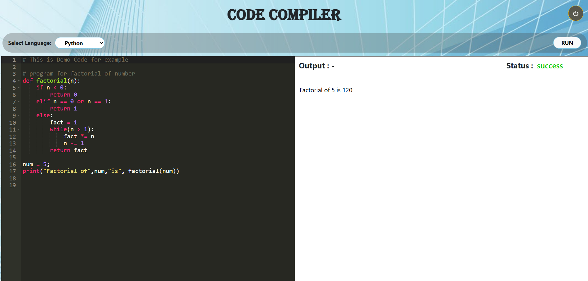

# 🚀 OneCodeLive - Frontend

Frontend for **OneCodeLive**, an online code compiler platform where users can write, execute, and test code in multiple programming languages directly from the browser.

🌐 Live App: https://onecodelive.vercel.app/

---

## 🧪 Test Credentials

Email: test@mail.com  
Password: test@123

---



## 📌 Features

- 🔐 User Authentication
  - Signup
  - Login
  - Forgot Password (Email-based reset link)

- 🧑‍💻 Code Editor
  - Supports multiple programming languages
  - Clean and responsive UI

- ⚡ Code Execution
  - Run code in real-time
  - Output displayed instantly

---

## 🛠️ Tech Stack

- **Framework:** Next.js 12
- **Language:** JavaScript
- **Styling:** CSS
- **HTTP Client:** Axios / Fetch API
- **Deployment:** Vercel

---

## ⚙️ Getting Started

### 1️⃣ Clone the repository

```bash
git clone https://github.com/devisinghlodhi/onlinecode_frontend.git
cd onlinecode_frontend
```

## 2️⃣ Install dependencies
```
npm install  
# or  
yarn install  
```
## 3️⃣ Setup Environment Variables

Create a `.env.local` file in the root directory and add:
```
NEXT_PUBLIC_API_URL="http://localhost:5000/api"
```

## 4️⃣ Run the development server
```
npm run dev  
# or  
yarn run dev  
```
The application will run at:
```
👉 http://localhost:3000
```
